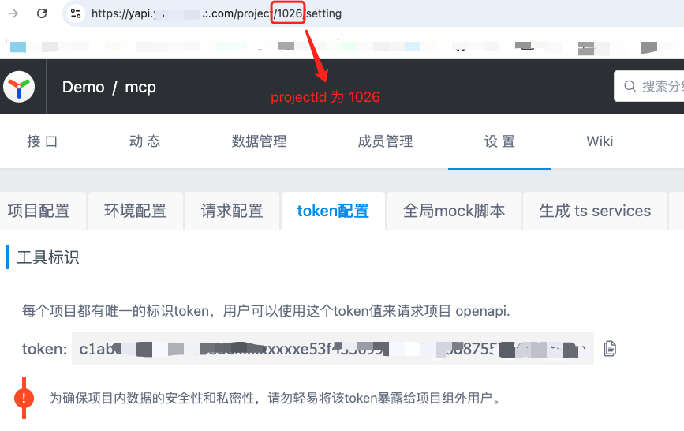

# Yapi MCP Server

一个用于 YApi 的 Model Context Protocol (MCP) 服务器，让你能够在 Cursor 等 AI 编程工具中直接操作 YApi 接口文档。

## 项目简介

Yapi MCP Server 是一个基于 [Model Context Protocol](https://modelcontextprotocol.io/) 的服务器，专为 YApi 接口管理平台设计。它允许你在 Cursor、Claude Desktop 等支持 MCP 的 AI 工具中直接：

- 🔍 **搜索和查看** YApi 项目中的接口文档
- ✏️ **创建和更新** 接口定义
- 📋 **管理项目和分类** 结构
- 🔗 **无缝集成** AI 编程工作流

通过 MCP 协议，AI 助手可以理解你的 YApi 接口结构，在编程过程中提供更准确的建议和代码生成。

## 主要功能

### 🔍 接口查询和搜索

- **yapi_search_apis**: 按名称、路径、标签等条件搜索接口
- **yapi_get_api_desc**: 获取特定接口的详细信息（请求/响应结构、参数等）
- **yapi_list_projects**: 列出所有可访问的项目
- **yapi_get_categories**: 获取项目下的接口分类和接口列表

### ✏️ 接口管理

- **yapi_save_api**: 创建新接口或更新现有接口
  - 支持完整的接口定义（路径、方法、参数、请求体、响应等）
  - 支持 JSON Schema 和表单数据格式
  - 自动处理接口状态和分类管理

### 🎯 智能特性

- **多项目支持**: 同时管理多个 YApi 项目
- **缓存机制**: 提高查询响应速度
- **详细日志**: 便于调试和监控
- **灵活配置**: 支持环境变量和命令行参数

## 快速开始

### 推荐方式：使用 npx（无需安装）

1. **获取 YApi Token**：登录你的 YApi 平台，在项目设置中获取 Token
2. **配置 Cursor**：在 Cursor 设置中添加 MCP 服务器：

```json
{
  "mcpServers": {
    "yapi-mcp": {
      "command": "npx",
      "args": [
        "yapi-mcp",
        "--stdio",
        "--yapi-base-url=https://your-yapi-domain.com",
        "--yapi-token=projectId:your_token_here"
      ]
    }
  }
}
```

3. **开始使用**：重启 Cursor，你就可以在对话中直接操作 YApi 了！

## 安装配置

### 方式一：npx 直接使用（推荐）

无需本地安装，通过 npx 直接运行：

```json
{
  "mcpServers": {
    "yapi-mcp": {
      "command": "npx",
      "args": [
        "yapi-mcp",
        "--stdio",
        "--yapi-base-url=https://yapi.example.com",
        "--yapi-token=projectId:token1,projectId2:token2",
        "--yapi-cache-ttl=10",
        "--yapi-log-level=info"
      ]
    }
  }
}
```

### 方式二：使用环境变量

在 MCP 配置中定义环境变量：

```json
{
  "mcpServers": {
    "yapi-mcp": {
      "command": "npx",
      "args": ["yapi-mcp", "--stdio"],
      "env": {
        "YAPI_BASE_URL": "https://yapi.example.com",
        "YAPI_TOKEN": "projectId:token1,projectId2:token2",
        "YAPI_CACHE_TTL": "10",
        "YAPI_LOG_LEVEL": "info"
      }
    }
  }
}
```

### 方式三：本地开发模式

适合需要修改代码或调试的场景：

1. **克隆和安装**：

```bash
git clone <repository-url>
cd yapi-mcp
pnpm install
```

2. **配置环境变量**（在项目根目录创建 `.env` 文件）：

```env
# YApi 基础配置
YAPI_BASE_URL=https://your-yapi-domain.com
YAPI_TOKEN=projectId:your_token_here,projectId2:your_token2_here

# 服务器配置
PORT=3388

# 可选配置
YAPI_CACHE_TTL=10
YAPI_LOG_LEVEL=info
```

3. **启动服务**：

**SSE 模式**（HTTP 服务）：

```bash
pnpm run dev
```

然后在 Cursor 中配置：

```json
{
  "mcpServers": {
    "yapi-mcp": {
      "url": "http://localhost:3388/sse"
    }
  }
}
```

**Stdio 模式**：

```bash
pnpm run build
node dist/cli.js --stdio
```

## 使用指南

### 获取 YApi Token

1. 登录你的 YApi 平台
2. 进入项目设置页面
3. 在 Token 配置中生成或查看 Token



Token 格式说明：

- 单项目：`projectId:token`
- 多项目：`projectId1:token1,projectId2:token2`

### 使用示例

配置完成后，你可以在 Cursor 中这样使用：


**常用操作示例**：

1. **搜索接口**：

   > "帮我找一下用户登录相关的接口"

2. **查看接口详情**：

   > "显示用户注册接口的详细信息"

3. **创建新接口**：

   > "帮我创建一个获取用户列表的接口，路径是 /api/users，使用 GET 方法"

4. **更新接口**：
   > "更新用户登录接口，添加验证码参数"

## 高级配置

### 命令行参数详解

| 参数               | 描述                          | 示例                                       | 默认值 |
| ------------------ | ----------------------------- | ------------------------------------------ | ------ |
| `--yapi-base-url`  | YApi 服务器基础 URL           | `--yapi-base-url=https://yapi.example.com` | -      |
| `--yapi-token`     | YApi 项目 Token（支持多项目） | `--yapi-token=1026:token1,1027:token2`     | -      |
| `--yapi-cache-ttl` | 缓存时效（分钟）              | `--yapi-cache-ttl=10`                      | 10     |
| `--yapi-log-level` | 日志级别                      | `--yapi-log-level=info`                    | info   |
| `--port`           | HTTP 服务端口（SSE 模式）     | `--port=3388`                              | 3388   |
| `--stdio`          | 启用 stdio 模式（MCP 必需）   | `--stdio`                                  | -      |

### 环境变量说明

创建 `.env` 文件进行配置：

```env
# 必需配置
YAPI_BASE_URL=https://your-yapi-domain.com
YAPI_TOKEN=projectId:your_token_here

# 可选配置
PORT=3388                    # HTTP 服务端口
YAPI_CACHE_TTL=10           # 缓存时效（分钟）
YAPI_LOG_LEVEL=info         # 日志级别：debug, info, warn, error, none
```

### 日志级别说明

- **debug**: 输出所有日志，包括详细的调试信息
- **info**: 输出信息、警告和错误日志（默认）
- **warn**: 只输出警告和错误日志
- **error**: 只输出错误日志
- **none**: 不输出任何日志

### 配置方式选择建议

| 使用场景 | 推荐方式              | 优势               |
| -------- | --------------------- | ------------------ |
| 日常使用 | npx + 命令行参数      | 无需安装，配置简单 |
| 团队共享 | npx + 环境变量        | 配置统一，易于管理 |
| 开发调试 | 本地安装 + SSE 模式   | 便于调试和修改代码 |
| 企业部署 | 本地安装 + stdio 模式 | 性能更好，更稳定   |
